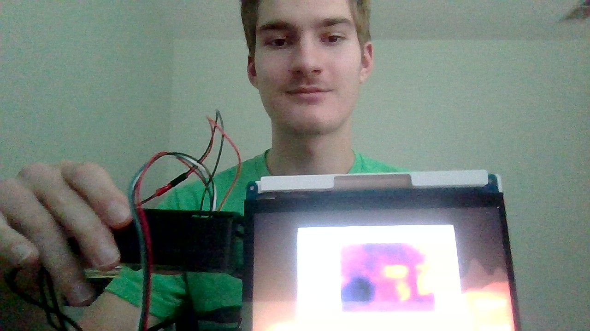
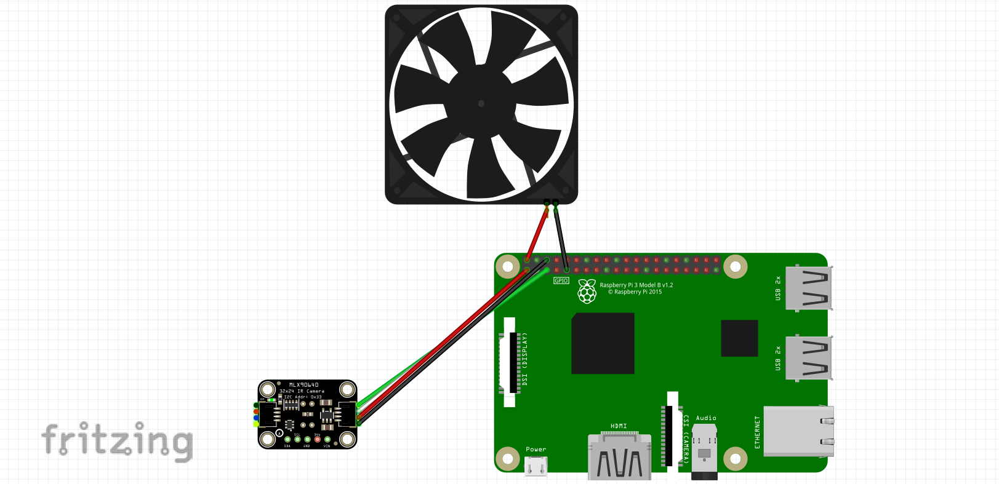

# Thermal Imaging Camera
Normal humans can only see visible light. Imagine being able to see in an entirely new dimension - heat! With the power of a Raspberry Pi 4 and an MLX90640-D55 thermal camera, you can explore the new world of thermal vision and see beyond the ordinary. The thermal camera captures raw data which is then processed by the Raspberry and displayed as a thermogram.


| **Engineer** | **School** | **Area of Interest** | **Grade** |
|:--:|:--:|:--:|:--:|
| Alexandru T | Cambridge High School | Mechanical Engineering | Incoming Junior




<br>

# First Milestone

<iframe width="560" height="315" src="https://www.youtube.com/embed/yVGZo8T66iE?si=1QpRDz8t5H55B18i" title="YouTube video player" frameborder="0" allow="accelerometer; autoplay; clipboard-write; encrypted-media; gyroscope; picture-in-picture; web-share" referrerpolicy="strict-origin-when-cross-origin" allowfullscreen></iframe>

- For the first milestone, I decided to set up the Raspberry Pi and connect it to the thermal camera to begin receiving text-only temperature readings.
- So far, the project includes a Raspberry Pi 4B, an MLX90640-D55 thermal camera, and python code. The camera scans the surrounding area to gather thermal data, then sends it to the Raspberry Pi, which uses the python code to interpret the data and display it in text format on the command terminal. The Raspberry Pi acts as the brain of the project, taking data from the camera, interpreting the data, sending the data elsewhere, as well as distributing power to all components. By itself, the thermal camera has no ability to process the thermal readings or display any data. The Raspberry Pi is therefore essential to be able to use the data, and the python code is the crucial element informing the Raspberry Pi on how to take raw thermal readings and use mathematical algorithms to translate thermal data into temperatures.

<br>

## Technical Progress

<br>

### Setting up the Raspberry Pi
- I first set up the Raspberry Pi, using the Raspberry Pi Imager to install the operating system onto a micro SD card from my computer. I then took the micro SD and plugged it into the Raspberry Pi, enabling it to have an operating system. After this, updates and upgrades were installed to ensure that the Pi was up to date, along with specific packages such as adafruit-blinka. These packages were necessary to ensure that python could run on the Raspberry Pi.
### Connecting the Camera
- Next, I had to connect the camera to the Raspberry Pi, with each of the four wires needing to connect to specific pins. The camera uses a 3V power supply, corresponding to pin 1 on the Pi. The camera also has two communication wires, SDA (Serial Data) and SCL (Serial Clock). SDA transferrs the actual information, while SCL controls the speed of communication and the rate at which information is exchanged between the Pi and the camera.
### Coding
- The final step of my first milestone was using python code to allow the Raspberry Pi to properly process the information given to it by the thermal camera. Although the Pi acts as the brain of the operation, it does not know how to actually use the information until the python code tells it how to interpret the raw thermal data. When the code is run, the camera records data and sends it to the Raspberry Pi. The Pi processes the data and turns it into temperatures which are then displayed on the command terminal.

<br>
  
## Challenges
- A first major obstacle I came across was installing the necessary python packages when setting up the Raspberry Pi. The Raspberry Pi uses built-in python in its operating system to control certain elements. Installing python packages acts as a danger to this operating system, potentially overwriting or damaging core files needed for the Raspberry Pi to function. As such, the Pi protects itself from these installations, blocking them from occuring. Therefore, I needed to create and activate a python virtual environment within the Raspberry Pi, which allowed me to install essential packages inside of a protected environment where the operating system could not be damaged.
- Another challenge occured when plugging in the camera to the Raspberry Pi. The camera specifically needs a 3V power source, and anything above that could cause damage. Because the Raspberry Pi has both 3V and 5V pins, I needed to be very careful when plugging in the camera, or I could have caused permanent damage.

<br>

## Future Plans
- Now that the camera is connected and the Raspberry Pi is fully set up, I need to create a visual representation of the thermal data. For this, I will need to find a display, such as a monitor, and I will need python code. Instead of converting data into text-only temperatures, I will need the code to convert the thermal data into a constantly updating graphic representing surrounding temperatures with colors. After this is completed, I plan to begin working on modifications to my project, which could include additional electronic parts and protective casings for components.


<br>

# Second Milestone

**Don't forget to replace the text below with the embedding for your milestone video. Go to Youtube, click Share -> Embed, and copy and paste the code to replace what's below.**

<iframe width="560" height="315" src="https://www.youtube.com/embed/soFmJLbfSio?si=3WR9Np-5L3k8PV4e" title="YouTube video player" frameborder="0" allow="accelerometer; autoplay; clipboard-write; encrypted-media; gyroscope; picture-in-picture; web-share" referrerpolicy="strict-origin-when-cross-origin" allowfullscreen></iframe>

<br><br>

## Technical Progress

### Coding
- To progress from text-only readings to an actual image, I had to replace the text-only code with a new Python script that converts the raw thermal readings into a thermogram. When run, the thermal camera now displays an image on a monitor connected to the Raspberry Pi. However, the resulting image is low-quality and provides a very limited and pixelated view. To solve this, I added another Python script that interpolated the original 24x32 thermal display, resulting in a smoother and enhanced image. Interpolation estimates unknown data values between known values. As such, the image now contains "artificial" pixels interspersed between the original pixels. These new pixels are approximations of the thermal values between the pixels of the original 24x32 display, creating both a higher resolution image and a smoother display. 
### Modifications
- While using the camera, I had to be very careful, as the Raspberry Pi was exposed and was very easy to damage. It was also becoming difficult to touch, as my camera detected that the Pi was reaching temperatures of up to 42 degrees Celsius. Although this is not dangerous for the Raspberry Pi itself, it made the camera hard to handle. Therefore, I decided to add copper heatsinks and a fan. The heatsinks are attached to the main chips of the Pi, using the conductive property of copper to draw heat away from the chips and into the heatsink. The fan then pumps air across the surface of the heatsink, dispersing the heat. I also added a protective case to protect the Raspberry Pi, where the lid of the case also holds the fan in place. The protective case makes the cooling system even more essential, as a lone Raspberry Pi in a closed low-ventilation plastic case would easily overheat.


<br>

## Challenges
- When I first connected my camera to the Raspberry Pi and ran the Python script, an image showed up, but it was a single frozen frame displaying incorrect temperature values. After checking the wire connections and attempting to edit the code, I came to the conclusion that the sensor was corrupted and the camera could not be used to obtain thermal images. I had to then use a replacement camera in order for my project to work. The corruption could have been caused by a small static shock from my hands or the environment, so I decided to be very careful with the replacement camera. I researched and found out that the MLX90640 thermal camera comes inside of an anti-static bag. When not using the camera, I kept the camera inside of the bag to avoid any electric discharge. When I had to use the camera, I carefully removed it from the bag only after touching a grounded metal object to discharge any static electricity from my body.
- The replacement camera was in perfect condition, but while I was adding my fan, the ground wire was damaged. The fan had a 5V wire and a ground wire, both encased within a plastic connector. As such, they had to be placed adjacent to each other on the Raspberry Pi's 40-pin layout. The only possible orientation for this was to place the plastic connector at pins 4 and 6, which was next to the wires for the thermal camera. Because the plastic casing for the fan wires was fairly large, placing it next to the camera wires led to bending and damage, even if the damage was not visible. Combined with the strained position caused by the lid of the case, the ground wire was damaged and stopped working. I remembered that the old thermal camera had functional wires, and just the camera itself was damaged. I chose to swap the wires from the new camera with those from the old camera, resulting in a functioning camera with a fully functional set of wires. Furthermore, to add the fan back, I needed to find a way to place it in a different position. I realized that I could use male to female jumper wires to be able to put the 5V wire and the ground wire in different positions on the Raspberry Pi. These wires were also smaller, so they would not cause damage to surrounding connections. This allowed me to operate both the camera and the fan at the same time.
- The orientation of the lid on top of the wires also caused damage, as the lid of the protective case was causing the wires to bend out of shape. To solve this, I cut a small hole in the lid to allow the wires for the camera to pass through. This allowed the wires to sit in their natural orientation without deformation.

<br>

## Future Plans
- Currently, the thermal camera can display an image of the surrounding temperatures. However, it must remain plugged into an outlet in the wall and the display relies on a stationary computer monitor. This makes the camera extremely limited, as it cannot be moved. I plan to use a 7-inch display and a portable battery to make the thermal camera portable. This way, it can be carried around to any location for as long as the battery lasts.

 <br>

# Final Milestone

<iframe width="560" height="315" src="https://www.youtube.com/embed/js9pe2sEOaI?si=i4xWt17ODGwvOYPS" title="YouTube video player" frameborder="0" allow="accelerometer; autoplay; clipboard-write; encrypted-media; gyroscope; picture-in-picture; web-share" referrerpolicy="strict-origin-when-cross-origin" allowfullscreen></iframe>

<br><br>

## Modifications
- Previously, my camera had to stay plugged in to a stationary computer monitor and to an outlet in the wall. I finished making my thermal camera portable by adding a 5V output portable battery and a 7-inch display screen. With these changes, I can now carry around my camera to any location, making it much more efficient and useful in real-world scenarios.
- I then added a 3D-printed protective case around the monitor. Similarly to the Raspberry Pi the monitor also had exposed electronic components that could be damaged if touched. I decided to add the case to make the screen easier both safer and easier to hold.

<br>

## Challenges
- My biggest challenges occurred when my first camera broke and when I had wiring issues. However, these major setbacks also led to my greatest triumphs. The MLX 90640 camera is very sensitive to static shock, and my initial camera was likely damaged by some form of electric discharge. When I first tried to run my code, a thermal image showed up, but it consisted of a single frozen frame with incorrect temperature readings. I first checked my code, in case there were any mistakes. I then checked to see if the Raspberry Pi could actually detect the device, in case the wires were damaged. Because the code and the wiring seemed to be correct, it led me to the conclusion that the camera was the only part that could have been damaged. After researching, I learned that the camera was very sensitive to static. Static shock damaging the camera's board matched the symptoms I was seeing perfectly. I solved this by ordering a replacement part, which worked well. My second setback occurred when I attempted to connect a 5V fan directly adjacent to the wires from my thermal camera. This led to wire overcrowding, damaging the camera's ground wire. I had to replace the wires from my new camera with those from my old camera, which I had previously discovered were perfectly functional. I then added jumper wires to the 5V fan to be able to individually place the 5V power wire and the ground wire in different places, as they were previously connected in a plastic housing and had to be placed next to each other. Jumper wires allowed me to create space for the camera wires, ensuring that nothing was damaged.
- By facing these challenges, I learned important lessons about troubleshooting and finding workarounds. When something does not work at first, it is incredibly easy, often convenient, to assume that parts are broken. However, it is likely that there were small mistakes or overlooked parts that caused the errors. It is also important to try to find workarounds for difficult problems. For example, I initially believed that I would have to remove the fan completely due to wire overcrowding, but I realized that I could use jumper wires to separate and extend the fan wires to keep them away from the camera wires.
- I gained important hands-on experience, translating concepts I knew into a tangible project, as well as gaining entirely new skills. I learned how to set up and use a Raspberry Pi, as well as how to use SSH to connect and code on the Pi. I then learned how to use sensors such as the MLX thermal camera and how to wire components to the Raspberry Pi. I also gained insight into the engineering process, including the difficulties, rewards, and skills needed to succeed.

<br>

## Future Plans
- In the future, I am interested in creating more projects involving a Raspberry Pi. I also want to gain more experience with coding, potentially in multiple different languages, in order to expand the possible functions of my projects. Most importantly, I want to continue gaining more engineering experience and learning important lifelong lessons.

<br>

# Schematics 


<br>

# Code 

<br>

## Text-only Readings
```python
import time
import board
import busio
import numpy as np
import adafruit_mlx90640
 
def main():
    # Setup I2C connection
    i2c = busio.I2C(board.SCL, board.SDA, frequency=400000)
    mlx = adafruit_mlx90640.MLX90640(i2c)
    mlx.refresh_rate = adafruit_mlx90640.RefreshRate.REFRESH_2_HZ
 
    frame = np.zeros((24 * 32,))  # Initialize the array for all 768 temperature readings
 
    while True:
        try:
            mlx.getFrame(frame)  # Capture frame from MLX90640
            average_temp_c = np.mean(frame)
            average_temp_f = (average_temp_c * 9.0 / 5.0) + 32.0
            print(f"Average MLX90640 Temperature: {average_temp_c:.1f}C ({average_temp_f:.1f}F)")
            time.sleep(0.5)  # Adjust this value based on how frequently you want updates
 
        except ValueError as e:
            print(f"Failed to read temperature, retrying. Error: {str(e)}")
            time.sleep(0.5)  # Wait a bit before retrying to avoid flooding with requests
        except KeyboardInterrupt:
            print("Exiting...")
            break
        except Exception as e:
            print(f"An unexpected error occurred: {str(e)}")
 
if __name__ == "__main__":
    main()
```

<br>

## Interpolated Thermal Visual Code
```python
import time
import board
import busio
import numpy as np
import adafruit_mlx90640
import matplotlib.pyplot as plt
 
def initialize_sensor():
    i2c = busio.I2C(board.SCL, board.SDA)
    mlx = adafruit_mlx90640.MLX90640(i2c)
    mlx.refresh_rate = adafruit_mlx90640.RefreshRate.REFRESH_4_HZ
    return mlx
 
def setup_plot():
    plt.ion()
    fig, ax = plt.subplots(figsize=(12, 7))
    therm1 = ax.imshow(np.zeros((24, 32)), vmin=0, vmax=60, cmap='inferno', interpolation='bilinear')
    cbar = fig.colorbar(therm1)
    cbar.set_label('Temperature [°C]', fontsize=14)
    plt.title('Thermal Image')
    return fig, ax, therm1
 
def update_display(fig, ax, therm1, data_array):
    therm1.set_data(np.fliplr(data_array))
    therm1.set_clim(vmin=np.min(data_array), vmax=np.max(data_array))
    ax.draw_artist(ax.patch)
    ax.draw_artist(therm1)
    fig.canvas.update()
    fig.canvas.flush_events()
 
def main():
    mlx = initialize_sensor()
    fig, ax, therm1 = setup_plot()
    
    frame = np.zeros((24*32,))
    t_array = []
    max_retries = 5
 
    while True:
        t1 = time.monotonic()
        retry_count = 0
        while retry_count < max_retries:
            try:
                mlx.getFrame(frame)
                data_array = np.reshape(frame, (24, 32))
                update_display(fig, ax, therm1, data_array)
                plt.pause(0.001)
                t_array.append(time.monotonic() - t1)
                print('Sample Rate: {0:2.1f}fps'.format(len(t_array) / np.sum(t_array)))
                break
            except ValueError:
                retry_count += 1
            except RuntimeError as e:
                retry_count += 1
                if retry_count >= max_retries:
                    print(f"Failed after {max_retries} retries with error: {e}")
                    break
 
if __name__ == '__main__':
    main()
```

<br>

# Bill of Materials


| **Part** | **Note** | **Price** | **Link** |
|:--:|:--:|:--:|:--:|
| MLX90640-D55 Thermal Imaging Camera | Capturing thermal radiation data for later processing | $66.30 | <a href="https://www.amazon.com/Arduino-A000066-ARDUINO-UNO-R3/dp/B008GRTSV6/](https://www.amazon.com/MLX90640-D55-Camera-Compatible-Firefighting-Maintenance/dp/B0FQHVSX91/ref=sr_1_1?dib=eyJ2IjoiMSJ9.jtNmEUR-VLfwR8hJ1WjkNVY3VPySrW2bIGnH2NSUyn6m8nhTRFDHPY6YVo4mLBkRc74tI_rWtxQjdTZxwcbizjL2RYnrAAuZNBwUwlVd7YqlmMfvj4r_R8B7PvDr6qpBePyuLE01dsYIQT7V5eSGT_kvE9efR4pfdsueW-OmAfiFNDadrS9jiiQyXJR-fLYbTfqnpk_jbZ-VEeOFLNXqqV9ip1bo3zLFXjRpoYvtOlA.CINsSo8TMzkVIALr3qcIUSqzT1uVdxTs3g-1aQQATSU&dib_tag=se&keywords=mlx90640-d55+thermal+imaging+camera%2C+32x34+IR+array&qid=1781014765&sr=8-1)"> Link </a> |
| USB to Micro SD Card Adapter | Adapting a Micro SD Card to USB for use on a computer | $8.99 | <a href="https://www.amazon.com/Arduino-A000066-ARDUINO-UNO-R3/dp/B008GRTSV6/](https://www.amazon.com/uni-Adapter-Supports-Compatible-MacBook/dp/B081VHSB2V/ref=sr_1_1_sspa?crid=4HMRF3ZXALEF&dib=eyJ2IjoiMSJ9.3vArOtBXB8aXRuKS3rF7i1W8da1mEJZ8FAyQegKc6Qv-nrgdHMgbAkmIkR88XQLEdRpD246tyGdE5FEj8RrFrqYi-7b8nIAgkHXmmnUqpGaUyuZhtWDp68ATDQwplNNrcK6h5DnuiBsgcLkHNhQpFTHu-9pgERSckNd66AyX1iG3Svd3cLGtrqwAUO78rHqmqVnRfLaZH-aZnLJgDjyg3RbDGqByar3kimNjPZCUdiS8dudgH8ajmyD8RSnFddEd7-72pyILS-f37yzbQZ8IzeDlUyC7Yf32Y0R3ZMZqw4k.czrbZM6nHxzsWFQhOnxFrCl8msMVR4X7z-G3IH3l9DI&dib_tag=se&keywords=uni%2Bsd%2Bcard%2Breader%2C%2Bhigh%2Bspeed%2Busb%2Bc%2Bto%2Bmicro%2Bsd&nsdOptOutParam=true&qid=1781014814&s=electronics&sprefix=uni%2Bsd%2Bcard%2Breader%2C%2Bhigh%2Bspeed%2Busb%2Bc%2Bto%2Bmicro%2Bsd%2Celectronics%2C112&sr=1-1-spons&sp_csd=d2lkZ2V0TmFtZT1zcF9hdGY&th=1)"> Link </a> |
| Raspberry Pi 4 4GB Starter Kit | Converting raw infrared radiation data to useable thermal readings and creating thermal images, as well as provifing useful additions to the Raspberry Pi | $147.79 | <a href="https://www.amazon.com/Arduino-A000066-ARDUINO-UNO-R3/dp/B008GRTSV6/](https://www.amazon.com/RasTech-Raspberry-Starter-Heatsink-Screwdriver/dp/B0C8LV6VNZ/ref=sr_1_1?crid=H858RUP1GVGJ&dib=eyJ2IjoiMSJ9.2HMtfI55o-jCAhg3n24VqcHqd28JgVwq_KHhbgkkY4I8SmClwzS1SWxigj4MRUP1vR7FwjO5d5VZvEkDfo3MCMX-fjZNvdKmAOmox1zTMs5O6UvQh4M5ciMj7XHkvVA4MbxLJNFpSMIyTYQUBuwe82-79JUo8-VHxRusRwNJktFidiGQROEb6xRUQBoaxJiFmMiIzHzByFXxRstYmg48ANKjXpPmnyBaUhu-Kb4VyJY.t1kDiKpg8nlTriBtHmPPfHmazEwSEM0OAZk--b7xDnE&dib_tag=se&keywords=raspberry%2Bpi%2B4%2B4gb%2Bstarter%2Bkit%2Bwith%2Bpi%2B4%2B4gb%2Bboard&nsdOptOutParam=true&qid=1781014855&sprefix=raspberry%2Bpi%2B4%2B4gb%2Bstarter%2Bkit%2Bwith%2Bpi%2B4%2B4gb%2Bboar%2Caps%2C128&sr=8-1&th=1)"> Link </a> |
| Elegoo Upgraded Electronics Fun Kit | Jumper wires and additional electronic components for future modifications | $13.59 | <a href="https://www.amazon.com/ELEGOO-Electronics-Potentiometer-tie-Points-Breadboard/dp/B09YRJQRFF/ref=sr_1_1?crid=KLEPFNRC166O&dib=eyJ2IjoiMSJ9.JqirajKUyZ6uAVBYmWDLYfLpUsrtoMvs1B6Cleaj-_tCGiP_t75U_0GI9wzy78zkLZv03zfQbFBrypHp7Um6U0paDDyTT3kihslKFCJ1fGzYSbFEhz5dKzO1nydx41FMV4B3UB6e3MMBVJOfmpT4XhUqQNwvIm8v1SLRgneJmaVfz5QsGmBt_UewI8qG8PY9ExIiofEsgE1yu4E8mEvOFs4mP609iSkEqLAyuYnxIlM.h4sxd--4QK_O1mElc6cF3QJsy_ClwPQpkvwtym23GUo&dib_tag=se&keywords=elegoo+upgraded+electronics+fun+kit&qid=1782308541&sprefix=elegoo+upgradedelectronics+fun+kit%2Caps%2C110&sr=8-1"> Link </a> |
| Hosyond 7" LCD Display | 7-inch portable display for visualizing thermal images | $36.79 | <a href="https://www.amazon.com/Hosyond-Display-1024%C3%97600-Capacitive-Raspberry/dp/B09XKC53NH/ref=sr_1_2_sspa?adgrpid=185077474263&dib=eyJ2IjoiMSJ9.Sophd7EceTdQ7WQOFpuYHTxXMkkm8GLZOqk6Sf_u9o51iUN3boTR3F8-hbwsph_WGqOV0FyuhXAFc7Gq88Lf4DGqQ1GJS0reGN9Jm_JuEv_LdsZr8DdazO2q3_31WZXILYcmkKpmYHbwWpCz6kVzQu9IWNm2ZeVeLYogt20UwfKB8GzbjGhhQS2Ql9WBq4obACxAH6npvllHAMv5rCFJOvm0nJC03W1b1ERmITTYHeg.kl9igvFTce-joTztK4Fjrf_bhkAL8egZiwfcyATDcwQ&dib_tag=se&hvadid=779528287117&hvdev=c&hvexpln=0&hvlocphy=9010753&hvnetw=g&hvocijid=5662668196022670780--&hvqmt=e&hvrand=5662668196022670780&hvtargid=kwd-2474963753682&hydadcr=18037_13447374_16249&keywords=hosyond%2B7%2Binch%2Btouchscreen&mcid=587a8d7b4df23ab0b2fe2b72ecf47f9e&qid=1782308758&sr=8-2-spons&sp_csd=d2lkZ2V0TmFtZT1zcF9hdGY&th=1"> Link </a> |

<br>

# Other Resources
- [Raspberry Pi Imager](https://www.raspberrypi.com/software/)
- [Raspberry Pi SSH Guide](https://www.onlogic.com/uk/blog/how-to-ssh-into-raspberry-pi/)
- [Raspberry Pi Setup](https://www.tme.com/in/en/news/library-articles/diy/page/64698/a-simple-guide-to-setting-up-a-raspberry-pi/)
- [Raspberry Pi Virtual Environment For Python](https://www.raspberrypi.com/news/using-python-with-virtual-environments-the-magpi-148/)
- [Fritzing](https://fritzing.org/)
- [DIY Thermal Camera](https://how2electronics.com/diy-thermal-imaging-camera-with-mlx90640-raspberry-pi/)
- [3D Print Models](https://www.printables.com/model/1295933-generic-aliexpress-7-hdmi-display-c-case-remix/files)
